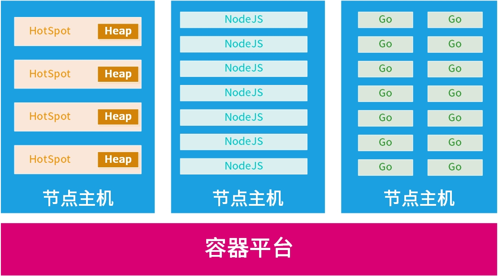
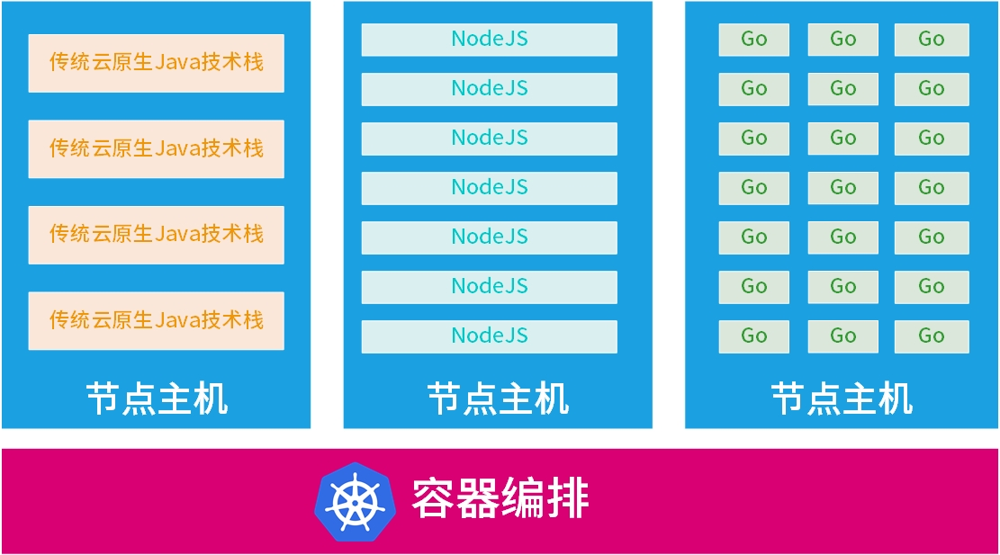
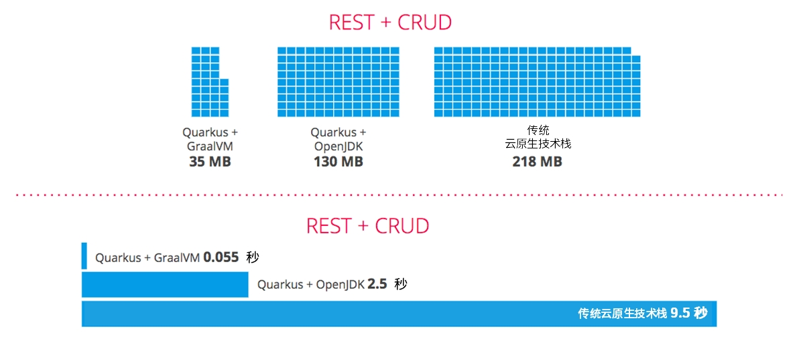
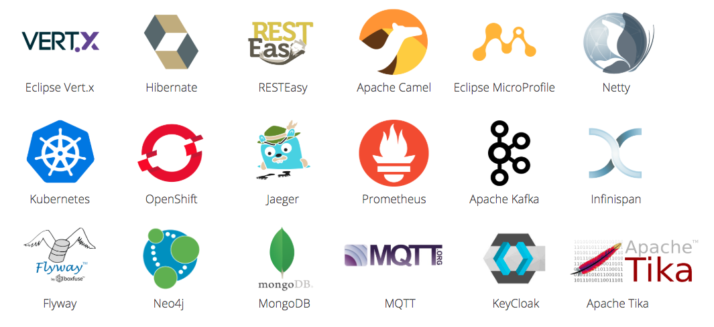
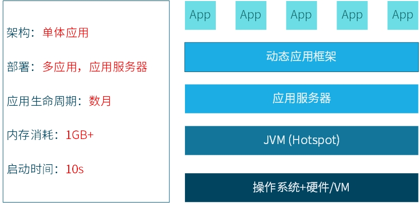
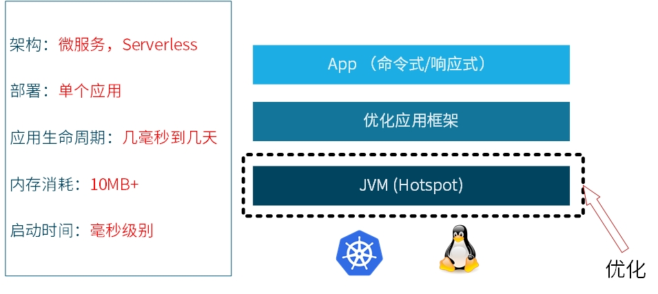
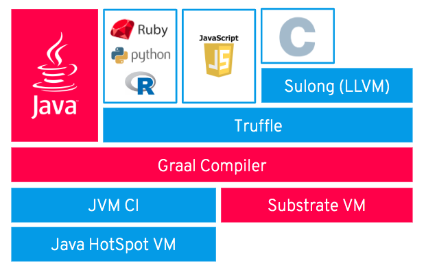
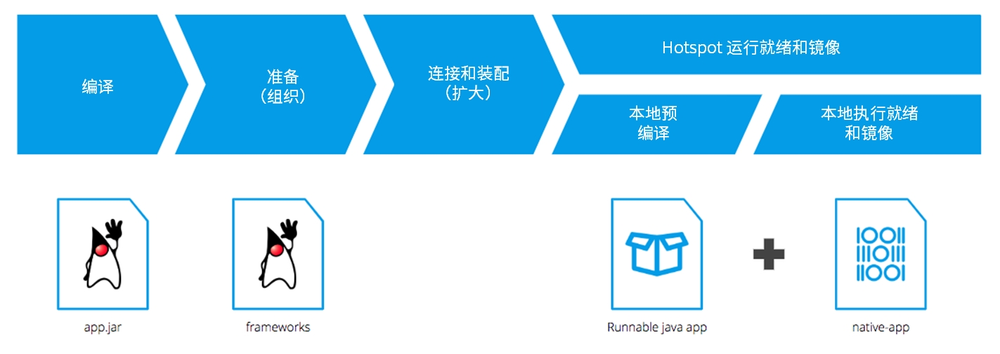

# Quarkus 初探

Quarkus是一个全栈的Kubernetes云原生Java开发框架，它配合Java虚拟机做本地应用编译。它是专门针对容器优化了的Java框架，使Java成为无服务器，云和Kubernetes环境中的高效开发基础。可以说Quarkus推动了Java在云原生开发方面的运用，使Java这门古老编程语言再一次焕发了青春。

这篇文章目的是为大家提供一些Quarkus的背景和技术基础知识，帮助快速了解并把它运用到实际开发实践中。如果想在企业应用中使用，建议参考购买**Red Hat Runtimes**订阅，Quarkus已经作为开发组件包含在这个企业版本的订阅服务当中。 

## Quarkus的价值

2020年1月，Quarkus赢得了DEVIES“代码框架/库最佳创新奖”。这是Quarkus获得的第一个重要奖项，未来它有望获得更多奖项。这说明从社区到市场都对它高度认可，毫不夸张地说，它已经掀起了一股风潮，严重动摇了传统Java应用框架的市场地位。

我们把Quarkus称为是“超音速亚原子Java”，它的价值体现在以下主要三个方面：

### 节约资源

Quarkus和传统Java框架相比占用内存更低、启动速度更快，这是数百倍的大幅度提升。举个栗子，由于其超快的启动速度特性，Quarkus可以实现快速故障转移，快到应用的用户甚至都感受不到出了故障就已经切换完毕了。因为Quarkus是面向云端开发的，它必须匹配Serverless、高密度Kubernetes容器和云原生应用等新应用开发模式下对资源和速度的需求。 

把Quarkus使用在生产环境中的用户一致认为节约成本是它的第一大价值。节省计算资源和开发工时，对用户尤其公有云用户来讲就是实实在在的省钱，这颠覆了之前引入新技术需要额外投入更多资源的观点。下面引用了一些比较典型的真实生产环境用户反馈：

- “我们可以在不牺牲服务可用性和响应时间的前提下运行比之前多三倍的密集部署负载”。 　　 　　
- “我们应用的启动时间从1分钟减少到400毫秒“。 　　　
- “我们在AWS Lambda使用Quarkus运行plain Java，启动时间从六到七秒钟减少到10毫秒”。

还有一点需要提及的是，尽管通过Quarkus native模式可以得到了最大化的资源节约，但即便采用Quarkus JVM模式同样可以达到节约资源效果。这对于使用了尚未加入到Quarkus组件库的组件开发应用，如ModelMapper的用户来说是个福音，他们仍然能够开心地收获到Quarkus的这个优势。

### 更快的实现和交付

Quarkus不仅仅是一个runtime，更是一个包含丰富扩展的生态系统，目前已经有超过90多个扩展，并且仍然在不断壮大。同时它学起来容易，一方面既是创新技术，另一方面Java程序员又都很熟悉，具有较短的学习曲线，也有大量优秀的参考文档。码农在编码时不会在等待应用程序启动上面浪费时间，可以让大家用较少的时间排除故障，减少了分析堆栈转储日志的情况，通过准确的错误信息直接定位到错误。这意味着它解放了开发人员的生产力。因此，企业也能快速掌握新技术能力，通过业务实现和交付的速度优势来确保在商业竞争中领先。

另外，社区还提供了应用脚手架在线生成工具。这个工具可以帮助用户引导Quarkus应用程序并探索其可扩展的生态系统。它可以将Quarkus扩展组件作为项目依赖；把扩展配置、启动和框架或技术融入Quarkus应用程序；还承担了为GraalVM提供正确的配置信息以供应用程序在进行本地编译的所有繁重的工作。

https://code.quarkus.io/

广大开发者对Quarkus的反响非常好：

- “Quarkus是一个令人难以置信的整合项目，它包括丰富的功能像MicroProfile、Vert.x、Kafka、Keycloak等等。” 　　 　　
- “在现有开发经验背景下，我们通过非常小的学习曲线，仅仅用两周时间就过渡到了基于Quarkus扩展的高效率开发模式。” 　　 　　
- “开发人员通常必须等待两到三分钟来将应用部署到服务器才能验证频繁修改的代码。实时编程让这个过程一去不复返了，它是Quarkus众多很棒的特性之一，也许还不是其中最出众的。”

### 技术可靠

Quarkus 已经发布了1.0版本，它的背后有像红帽这样的开源大厂商支持，是值得信赖的技术。Quarkus是完全的开源技术，它的上游社区十分活跃，版本发布节奏非常快，快速释放新特性和修复问题。依靠活跃的社区，维护者会快速回复问题和提供协助。用户会得到全面的问题解答。用户反馈Quarkus在可靠性方面的表现也是可圈可点的：

“一旦Quarkus的MongoDB客户端扩展组件发布，我们立即能够将整个服务切换到native模式”。

“Quarkus社区和Quarkus工程师非常活跃，即便在外部论坛也是如此。” 

“红帽在软件市场的信誉保证让我们相信，使用由红帽主导的Quarkus是正确的选择。”


## 已经投入使用公司

**德国汉莎航空公司**：Technik AVIATAR 提供以SaaS形式构建的设备维护、修理和运作数字化平台。

**Talkdesk**：提供云呼叫中心服务，即CCaaS。

**Suomen Asiakastieto Oy**：是金融风险评估公司。他们在特定应用程序的内部实现第二次支付服务指令，即PSD2。

**GoWithFlow**：是一家葡萄牙公司，他们提供用户公共交通导航服务。包括使用公共交通工具如公交车、地铁和火车以及摩托车、自行车租赁等等。

**希腊沃达丰**：是希腊第二大电信公司。 他们起初尝试用Quarkus重写他们的Spring Boot应用。最终，他们决定停止所有Spring Boot应用开发，转而使用Quarkus技术框架。

## Quarkus适用场景

**新建微服务**：任意的微服务架构都可以用Quarkus技术栈实现。 　　 　　

**Serverless**：Quarkus应用可以瞬间启动，它将Java成功引人Function-as-a-Service（FaaS）调用运行时的行列。由于整个技术栈都涵盖在Quarkus内，因此它具备在serverless环境中实现任何类型的业务逻辑所需的功能。 　　 　　

**响应式系统和物联网**：因为它的占用空间小，您可以发挥Quarkus在物联网应用程序和系统中的优势。在响应式系统和响应式编程方面，Quarkus非常适合面向处理异步和内置事件总线的应用。　 　　

**单体应用转为微服务**：在单体被拆分为微服务的情况下，无论是运行在服务器上的应用或Spring Boot应用都会占用很大的内存、启动时间很长。将这些应用迁移到Quarkus框架会是一个解决问题的好选择。

## Quarkus目标用户

**潜在兴趣者**

- 那些使用Red Hat®JBoss®企业应用平台（JBoss EAP）或在OpenShift®上运行Spring Boot的抱怨内存占用过多的用户；
- 那些希望应用数字化转型和现代化的用户；
- 那些由于某种原因想放弃Java转向Go或Python的用户；
- 那些提供很少被调用，但需要一直维护不能间断应用服务的用户；
- 那些正在寻找替代Netflix OSS容错能力方案的用户；
- 那些希望构建无服务功能，如部署serverless集成逻辑；
- 那些希望使用轻量级连接器集成Kafka的用户；
- 那些想用Java开发集成路由，需要用到Javascript或Groovy，同时也需要快速启动和低内存消耗的用户；
- 那些正在寻找基于BPMN和DMN，用轻量级运行时开发微服务，实现行之有效的决策和过程自动化业务逻辑的用户。

**不感兴趣者**：

- 用户担心Jakarta EE的未来，目前对JBoss EAP总体基本满意；
- 要求技术框架长期向下兼容，支持遗留api，或通用标准认证的用户；
- 使用基于角色的管理员访问JMX服务，配置修改或进行域管理的用户场景。

## Quarkus竞争对手

- Spring Boot

- Amazon Lambda

- Google Cloud Functions

- Microsoft Azure Functions

## Quarkus技术优势

### 容器运行时



Java语言诞生之时没有云、容器、Kubernetes （K8S）。当时，启动时间的长短取决于应用程序本身，而且大家都不太关注这个问题。此外，应用内存就是消耗主机内部硬件提供的内存。

当引入微服务和高分布式架构后，启动时间长短就变得十分重要，甚至成为区分Java框架优劣的主要标志。同时，伴随着云和容器技术不断运用到开发中，计算和内存资源消耗情况同样也成为技术选型的主要关注点。

上图逐个比较了典型的Java进程和其他竞争编程语言和框架（Node.js 和 Go）在内存资源使用方面的差异。其中，HotSpot 占用内存最多，包括在每一个JVM实例中分配的堆内存的占用。中间列显示了Node.js每个进程占用内存与Java的大致对比。在最右列，你会看到Golang编译语言，正是低内存消耗的原因，让它成为云上很受欢迎的开发语言。如图所示，同样资源的节点主机上，从左到右可以得到更高密度的应用部署。高密度应用场景表现差，这正是开发人员在云、容器和K8s中不愿意使用Java（也包括Spring Boot）的真正原因。

于是Red Hat建立了Quarkus，重新设计采用封装方法来构建和运行，这使Java运行时达到了与Go相当的水平。Quarkus还是一个完整生态系统，它能够为开发人员提供在云、容器和K8s环境中编写微服务和应用程序所需的一切能力和功能。

可能有些人会说，“现在内存已经很便宜了，真的需要为了节省内存引入新的应用技术栈吗?“。确实，对于开发单体应用来说，节省区区几百兆内存和启动时间，可能显得不那么重要。但另一方面，一些在容器编排平台上没有使用Quarkus的用户正在考虑放弃Java，他们纷纷反映，并不是因为他们不喜欢Java，仅仅由于Java会让内存迅速成为瓶颈。例如，在Openshift大规模部署Spring Boot应用，出现了平台用掉了90%的内存，而CPU利用率却还不到30%的情况。



第二个图片说明了这个问题。如果你有一个三节点OpenShift集群。在第一个节点部署Spring Boot应用程序，然后用Node.js和Go做同样类似功能的应用程序分别部署到第二和第三个节点。我们可以看到跑Spring Boot的节点应用实例数量大大少于运行Node.js和Go的节点。

### 技术优势和收益

**面向应用容器化的解决方案**：Quarkus为应用在HotSpot 和GraalVM运行做了优化和裁剪。它支持快速启动时间和较低的RSS内存使用，并且符合serverless架构。



Quarkus 是面向应用容器化开发解决方案。因此，同传统Java相比，有更快的应用程序的启动时间。无论应用程序托管在公有云或内部托管Kubernetes集群，快速启动和低内存消耗的特征是降低整体成本的重要保证。Quarkus 通过以下功能实现降低内存使用、加快启动时间的应用容器化设计理念：

- 对GraalVM和基础VM的优秀支持； 　　 　　
- 构建过程中的元数据处理； 　　
- 减少反射机制使用； 　　
- 本地镜像预引导。

从上图可以看到，Quarkus构建应用程序同传统Java应用相比能够将内存消耗减少到十分之一，启动时间加快高达300倍。正是这两个突出表现大大减少了云资源的投入成本。

**开发体验提升**：Quarkus提供实时编码和统一配置功能，不必在编译和部署上耗费大量时间。

- 易于使用：产品设计从一开始就考虑到易用性，启用功能不需要特殊配置；
- 自由选择运行模式：应用程序可以编译、运行在JVM和Native两种模式下；
- 整合和优化的开发者体验：基于标准和框架；统一配置；实时编码；精简80%常用代码，仅保留20%灵活代码；一致的本地运行文件生成。

**统一命令式和响应式编程**：Quarkus将阻塞式和非阻塞的代码相结合，包括一个内置的事件总线。

- 将命令式和响应式编程结合运用；

- 注入事件总线或Vert.x上下文 ；

- 开放采用适用场景的技术；
- 基于事件驱动的应用程序的响应式系统的关键技术。

Quarkus很容易支持将大家熟知的命令式风格代码与非阻塞（响应式风格）代码结合在一起开发应用程序。这样，就可以帮助所有Java开发者优化他们的应用，既可以兼容使用命令式模式并且不想重构的代码，又可以支持云原生方式或响应式模式开发的代码。Quarkus开发模型可以适应正开发的任何应用程序。可以注入事件总线或者Vert.x上下文，因此可以开放采用适用场景的技术，这是基于事件驱动的应用程序的响应式系统的关键。正是源于所有这些优势，使Quarkus成为在新开发领域如serverless架构，微服务，Kubernetes, FaaS 和云中运行Java的一种有效的解决方案。

**命令式代码示例**

```java
@Inject
SayService say;

@GET
@Produces(MediaType.TEXT_PLAIN)
public String hello() {
	return say.hello();
}
```

**响应式代码样例**

```java
@Inject @Stream(”kafka”)
Publisher<String> reactiveSay;

@GET
@Produces(MediaType.SERVER_SENT_EVENTS)
public Publisher<String> stream() {
	return reactiveSay;
}
```


**支持大量组件库和标准**：Quarkus运用广泛的框架和标准，目前支持超过90个扩展组件。它利用了开发人员现有的专业知识，同时具有时间较短的学习曲线，减少了开发人员的掌握它的时间和难度。




### 优化技术堆栈

#### 传统企业级Java技术栈

传统Java技术栈通常用于在应用程序服务器上运行多个应用程序的场景。在过去的15到20年间，Java应用程序栈被不断改进，用于运行支持大型堆内存和高度动态优化的运行时应用程序框架。程序启动时间为一两分钟已经被是认为是非常理想的状态了。在大多数情况下，采用这种技术栈通常分配专用硬件或大规模资源的虚机环境。



当容器和微服务开始变得流行，许多用户引入云原生Java技术栈。云原生技术栈通常把业务系统通过多个服务组合来实现，单个业务逻辑服务更容易维护，可以单独发布，发布频率不断加快，甚至可一天多次发布部署新版本服务。

现在，上述云原生Java技术栈也将被称为＂**传统**＂了。

#### Quarkus技术栈优化

传统的云原生技术栈和Quarkus之间的主要区别在于Quarkus为容器运行时进行了优化。这种优化简化了许多从运行时到构建时的动态行为。这为熟悉Java的开发人员提供了一个毫秒级启动和高度内存优化的技术栈。



### 构建和编译 

Quarkus使用GraalVM编译器，图中红色部分显示，可以编译本地二进制运行文件。Graal编译器做了许多工作，比如消除死代码依赖并将基础VM放入到本机运行的代码二进制运行时文件。



下图显示了Quarkus构建过程。第一步是编译，接下来就是准备，然后是连接和装配，最终的输出是HotSpot运行就绪文件和镜像，或本地可执行文件和镜像。



在传统的Java EE技术栈，需要针对不同应用服务器环境来进行优化。大部分的工作发生在启动和运行时。因此，动态运行时在不变的基础设施里会产生不必要的开销。那么，大家自然而然会想到，如果把这些重活累活放在构建的时候呢？Quarkus正是顺着这个思路将标准框架启动时所做的工作做了构建优化。

#### 标准框架启动时所做的工作

解析配置文件；类路径和类扫描，如注解、getter、元数据；构建框架元模型对象；准备反射和构建代理；启动IO和线程等资源。

#### Quarkus所做的构建优化

将上述工作尽可能多地放到构建阶段去做；最小化运行时依赖；尽可能消除死代码依赖；引入清晰的元数据契约；由全部到部分到最小化的反射优化级别范围。

Quarkus优化了框架，使它们的框架内更模块化，减少对框架自身的依赖。它会在构建阶段启动应用程序，扫描类路径，剔除不必要的依赖关系，将预先创建的二进制镜像放到 JAR 包。当应用程序启动时，它只是加载所有的预先扫描、打包好的代码并快速地执行它。这样，一个功能复杂的应用程序可能只需要一秒钟的启动时间。

Quarkus可以用传统的JDK构建应用程序或fat JAR，也可以用另一种方式，用GraalVM将代码编译成本地二进制执行文件。

### 选择适用的JVM

在考虑选用哪个VM搭配Quarkus时，应注意OpenJDK和GraalVM各自具有不同的特点。

#### OpenJDK HotSpot VM

- 较高密度内存需求

- 高请求

- 快速启动时间

- 优秀的CPU原始性能表现

- 完整的垃圾回收机制

- 更高的堆使用量

- 常用的监控工具

- 一次编译，到处运行

- 类库只能在标准JDK中使用

#### GraalVM Native Image

- 最高密度内存需求

- 在低堆占用下最高的s/MB请求

- 满足更快速启动时间

## HelloWorld

下面大家一起来实际感受一下，使用OpenJDK虚拟机开发Quarkus简单的HelloWorld应用程序。我们会创建一个提供hello Web服务的应用，这个应用会用到依赖注入特性，其中的服务用一个greeting bean实现。

#### 环境需求

需要在笔记本或开发机上安装以下工具软件：

- Git；

- Java™ JDK 11；

- 你熟悉的Java开发IDE；

- Maven 3.6.2 或以上版本。

#### 导入工程

大家可以从github上clone预先准备好的示例代码。

```shell
$ cd ~/
$ git clone https://github.com/shadowmanportfolio/cnd_quarkus_foundations_labs.git
$ cd ~/cnd_quarkus_foundations_labs
```

这是一个Maven工程，可以直接把它导入到IDE。这个工程有这几方面特征：

- 典型Maven工程的结构；

- 有一个org.acme.people.rest.GreetingResource类负责暴露 /hello服务, 还有配套的简单测试类。

- 应用启动后可以通过登录URL http://localhost:8080 访问到服务。

- 工程包含一个application.properties配置文件。

- 打开pom.xml 文件，可以看到依赖的 Quarkus BOM。

使用BOM的好处是可以忽略掉配置不同Quarkus版本依赖的麻烦工作，同时也可以避免依赖组件版本选择不当带来的冲突问题。

```xml
<dependencyManagement>
    <dependencies>
        <dependency>
            <groupId>io.quarkus</groupId>
            <artifactId>quarkus-bom</artifactId>
            <version>${quarkus.version}</version>
            <type>pom</type>
            <scope>import</scope>
        </dependency>
    </dependencies>
</dependencyManagement>
```

在pom.xml中还可以看到quarkus-maven-plugin 插件，它负责打包应用、管理开发模式以及导入依赖等辅助环节工作。 
接下来，我们打开位于 org.acme.people.rest 路径下的 GreetingResource.java。这是一个非常简单的REST服务，当有访问/hello的服务请求时返回”hello"字符串。

```Java
@Path("/hello")
public class GreetingResource {
    @GET
    @Produces(MediaType.TEXT_PLAIN)
    public String hello() {
        return "hello";
    }
}
```

Quarkus不像 JAX-RS，尽管是支持的，但它不必创建Application类。另外，只会创建一个资源实例，而不是为每一个请求都创建一个。当然，你可以通过Scoped注解来配置实例的作用范围，比如应用范围 ApplicationScoped 或请求范围RequestScoped。

#### 在线编程模式下运行应用

在线编程模式 (属于开发模式) 可以让开发者修改正在运行的应用并即时生效。Quarkus 会自动重新编译并加载修改后的新应用。在下面的代码修改过程中，大家能体会到这种强大和高效的开发风格。

可用以下的命令编译并运行应用程序。

```shell
mvn compile quarkus:dev
```

首次构建应用，Maven会下载依赖库组件。下载过程依网速快慢长短不一，但下载只会做一次，后续的构建就会很快了。启动时间会非常快，应用一下就在本地运行起来了，会看到类似下面的提示信息：

```shell
2020-02-28 17:05:22,347 INFO  [io.qua.dep.QuarkusAugmentor] (main) Beginning quarkus augmentation
2020-02-28 17:05:22,635 INFO  [io.qua.dep.QuarkusAugmentor] (main) Quarkus augmentation completed in 288ms
2020-02-28 17:05:22,770 INFO  [io.quarkus] (main) Quarkus started in 0.668s. Listening on: http://localhost:8080
2020-02-28 17:05:22,771 INFO  [io.quarkus] (main) Installed features: [cdi, resteasy]
```

 打开浏览器，访问URL: http://localhost:8080/hello ，会看到 hello 字样展现在页面上，说明服务运行正常。保持命令在后续操作过程中一直运行，然后我们就体验在线编程了。

用IDE打开 src/main/java/org/acme/people/rest 路径 GreetingResource.java 文件，将返回 "hello" 改为返回 "hola" 后保存。刷新浏览器页面，会看到页面已经更新成"hola"。

quarkus:dev 命令让 Quarkus 运行在开发模式下。这会打开后台编译功能，这就是当修改Java资源文件并刷新浏览器时，修改会自动生效的原因了。它同时会打开 5005 debugger 端口，可在命令行加 -Ddebug 参数使debugger在应用启动之前生效，如果不需要debugger，可在命令行加 -Ddebug=false 参数禁用它。

下面再次编辑 GreetingResource.java 文件，将返回的 "hola" 改回 "hello" 并保存文件。在浏览器验证是否页面返回结果被还原。

#### 打包应用

Quarkus 应用可以被打包成可执行 JAR 文件。

```shell
$ mvn package
```

运行这个命令会在 target/ 目录产生一个可执行 JAR 文件，名为 people-1.0-SNAPSHOT-runner.jar。这可不是一个 uber-jar 文件，依赖已经复制到了 target/lib 目录下。

#### 运行可执行 JAR 文件

```shell
$ java -Dquarkus.http.port=8081 -jar target/*-runner.jar
```


这里用 -Dquarkus.http.port=8081 启用8081端口避免了同在线编程示例使用的8080端口的冲突。当应用启动完毕，打开一个新命令行窗口执行下面的curl命令验证应用正常运行。

```shell
$ curl http://localhost:8081/hello
```

结果输出

```shell
hello
```

以上是构建了一个基本的quarkus应用程序的过程，这和开发普通的Java应用没有分别。应用会打包成可执行的JAR文件，并且很快启动起来。这个JAR文件可以像任何通常的可执行JAR文件一样使用，比如原样直接运行或把它封装成为Linux®容器镜像。

## 功能测试和单元测试

Quarkus若真要用于实际生产，开发者会比较关心如何有效地进行功能测试和单元测试。本节讨论如何对Quarkus构建的应用程序执行测试。我们会讨论Maven和Rest服务所需的依赖关系，并给出了一个单元测试示例。然后会描述运行测试的步骤，改变测试端口，并将静态资源和依赖注入到测试当中。还会介绍包括Quarkus对模拟对象的支持情况。

### 依赖组件

用Maven执行单元测试需要引入相应依赖组件：

```xml
<dependency>
    <groupId>io.quarkus</groupId>
    <artifactId>quarkus-junit5</artifactId>
    <scope>test</scope>
</dependency>
```


若要测试HTTP服务，还需要引入Rest Assured 依赖:

```xml
<dependency>
    <groupId>io.rest-assured</groupId>
    <artifactId>rest-assured</artifactId>
    <scope>test</scope>
</dependency>
```

Quarkus 对 Gradle 工具也已经支持了。

### 单元测试示例

下面是使用 HTTP 直接测试REST 服务的示例：

```Java
@QuarkusTest
public class GreetingResourceTest {
    @Test
    public void testHelloEndpoint() {
        given()
          .when().get("/hello")
          .then()
             .statusCode(200)
             .body(is("hello"));
    }
}
```

### 运行测试

用简单Maven命令就可以进行测试：

```shell
$ mvn clean test
```

默认的测试端口是 8080。如果需要改成别的端口，如8083，在application.properties 文件加上以下端口定义变量就可实现：

```properties
quarkus.http.test-port=8083
```

### 注入

注入依赖
Quarkus 可以通过CDI将依赖注入到测试代码中。下面是用 @Inject 注解注入GreetingService 依赖的例子：

```Java
@QuarkusTest
public class GreetingServiceTest {

    @Inject
    GreetingService service;

    @Test
    public void testGreetingService() {
        Assertions.assertEquals("hello Quarkus", service.greeting("Quarkus"));
    }
}
```


### 模拟对象

Quarkus 还支持使用模拟对象，可以使用CDI注解@Mock将模拟对象注入代码。

```Java
@Mock
@ApplicationScoped
public class MockExternalService extends ExternalService {

    @Override
    public String service() {
        return "mock";
    }
}
```

## 单元测试初探

在上述HelloWorld环节中，我们导入了一个Maven工程并将它编译和运行了起来。接下来我们再研究一下这个工程。

打开 `pom.xml` 文件，可以看到有下面两个测试依赖：

```xml
<dependency>
    <groupId>io.quarkus</groupId> 
    <artifactId>quarkus-junit5</artifactId>
    <version>${quarkus.version}</version>
    <scope>test</scope>
</dependency>
<dependency>
    <groupId>io.rest-assured</groupId> 
    <artifactId>rest-assured</artifactId>
    <scope>test</scope>
</dependency>
```

- `quarkus-junit5` 组件是测试需要用到的，它提供了 `@QuarkusTest` 注解来控制测试框架。
- `rest-assured` 组件不是必须的，但用它来做HTTP服务测试比较方便。不需要额外配置就可以把它集成进来自动调用正确的URL。

打开 `src/test/java/org/acme/people/GreetingResourceTest.java` 可以看到测试方法 testHelloEndpoint 有三个主要功能：

- 访问 `/hello` REST 服务；
- 测试成功的 HTTP 服务返回状态码 200；
- 测试返回的报文体是否是 `hello`。

```java
@QuarkusTest
public class GreetingResourceTest {
    @Test
    public void testHelloEndpoint() {
        given()
          .when().get("/hello") 
          .then()
             .statusCode(200) 
             .body(is("hello")); 
    }
}
```

### 增加测试方法

在这一部分，我们为 `/hello/greeting` 服务增加一个新的测试方法。

将下面的代码加入到 `GreetingResourceTest` 类：

```java
    @Test
    public void testGreetingEndpoint() {
        String uuid = UUID.randomUUID().toString();
        given()
          .pathParam("name", uuid) 
          .when().get("/hello/greeting/{name}") 
          .then()
            .statusCode(200) 
            .body(startsWith("hello " + uuid)); 
    }
```

这个方法的主要作用是：

- 定义一个路径参数名为 `name` ，并赋值为随机 UUID；
- 访问 `/hello/greeting/{name}` REST 服务并传递 `name` 参数值；
- 测试成功的 HTTP 服务返回状态码 200；
- 测试返回的报文体是否是以`hello`开头加上 UUID的字符串。

### 运行测试

执行下面的命令测试应用：

```sh
$ mvn clean test
```

测试命令会运行并最终完成。但是，有可能你会看到报错。这是因为您先前修改了greeting代码。

找到`GreetingResource.java` 代码中的 `GreetingResource` 类确保将 `hola` 改成了 `hello`。

再次执行测试命令，将看到所有测试都会通过。

#### 修改测试端口

默认 Quarkus 的监听端口是 8080 ，您可以修改成别的端口，比如 8081。如果先前练习中有HelloWorld进程还在运行的话，这样就可以并行的进行测试了。

配置端口可以在 `application.properties` 文件中用 `quarkus.http.test-port` 参数实现。

1. 打开 `src/main/resources/application.properties` 文件；
2. 在文件末尾另起一行加入下面的内容；

```texinfo
quarkus.http.test-port=8083
```

3. 再次运行测试，检查启动日志，将会看到下面的包括当前使用端口的日志文字。

```texinfo
INFO  [io.quarkus] (main) Quarkus x.xx.x started in 1.997s. Listening on: http://[::]:8083
```

#### 注入URI

直接在测试中注入URL也是可以的，这可以方便使用不同的客户端。通过 `@TestHTTPResource` 注解来实现。本节中，将演示如何在一个简单测试中加入静态资源。

1. 创建一名为 `src/main/resources/META-INF/resources/test.html` 的新文件。

2. 在文件中加入以下内容：

   ```texinfo
   <!DOCTYPE html>
   <html>
   <head>
   <meta charset="UTF-8">
   <title>Testing with Quarkus</title> 
   </head>
   <body>
   
   </body>
   </html>
   ```


 `Testing with Quarkus` 是HTML中的标题，用于验证资源是否能成功注入。

3. 创建一个新测试类：

   放置在 `src/test/java` 目录；

   定义如下包路径 `org.acme.people` ；

   将这个类命名为 `StaticContentTest` 。

4. 将下面内容加入到 `StaticContentTest.java` 文件：

   ```java
   package org.acme.getting.started.testing;
   
   import java.io.ByteArrayOutputStream;
   import java.io.IOException;
   import java.io.InputStream;
   import java.net.URL;
   import java.nio.charset.StandardCharsets;
   
   import org.junit.jupiter.api.Assertions;
   import org.junit.jupiter.api.Test;
   
   import io.quarkus.test.common.http.TestHTTPResource;
   import io.quarkus.test.junit.QuarkusTest;
   
   @QuarkusTest
   public class StaticContentTest {
   
       @TestHTTPResource("test.html") 
       URL url;
   
       @Test
       public void testIndexHtml() throws Exception {
           try (InputStream in = url.openStream()) {
               String contents = readStream(in);
               Assertions.assertTrue(contents.contains("<title>Testing with Quarkus</title>"));
           }
       }
   
       private static String readStream(InputStream in) throws IOException {
           byte[] data = new byte[1024];
           int r;
           ByteArrayOutputStream out = new ByteArrayOutputStream();
           while ((r = in.read(data)) > 0) {
               out.write(data, 0, r);
           }
           return new String(out.toByteArray(), StandardCharsets.UTF_8);
       }
   }
   ```


`@TestHTTPResource` 注解可以直接为Quarkus实例注入URL资源。 注解的值是URL路径，目前 `@TestHTTPResource` 允许注入 URI, URL, 和 URL表达式字符串。

3. 测试应用：

   ```sh
   $ mvn clean test
   ```

    `StaticContentTest` 类应该会顺利通过测试。

### 注入到测试

目前为止，已经研究了集成通信类的HTTP服务测试。那么怎样直接单元测试或测试bean呢？

Quarkus 允许通过 `@Inject` 注解注入CDI bean到测试代码当中来做单元测试。事实上，Quarkus 中的测试对象都是 CDI beans，所以你在测试中可以用到所有的 CDI 功能。在本节中，要创建一个简单测试方法，这个方法不运用HTTP调用，而是直接注入测试 greeting 服务。

1. 创建一个新测试类：

   置于 `src/test/java` 目录，导入 `org.acme.people` 包路径。

   创建一个新 `GreetingServiceTest` 类。

2. 在 `GreetingServiceTest.java` 文件中加入以下内容：

   ```java
   package org.acme.people;
   
   import javax.inject.Inject;
   
   import org.acme.people.service.GreetingService;
   import org.junit.jupiter.api.Assertions;
   import org.junit.jupiter.api.Test;
   import org.slf4j.Logger;
   import org.slf4j.LoggerFactory;
   
   import io.quarkus.test.junit.QuarkusTest;
   
   @QuarkusTest
   public class GreetingServiceTest {
   
       private static final Logger LOGGER = LoggerFactory.getLogger("GreetingServiceTest");
   
       @Inject 
       GreetingService service;
   
       @Test
       public void testGreetingService() {
           Assertions.assertTrue(service.greeting("Quarkus").startsWith("hello Quarkus"));
       }
   }
   ```


它用于注入 `GreetingService` 并且调用这个Bean，就像在production 代码调用 RESTful 资源服务所实现的功能一样。

3. 测试应用：

   ```sh
   $ mvn clean test
   ```

   等待 `GreetingServiceTest` 成功通过测试。

#### 探索更多

就像先前提到的一样，Quarkus 测试的实质上全是 CDI bean，因此可以使用 CDI 拦截器实现一般的应用逻辑。举个栗子，如果想让一个测试方法在事务中运行， 可以很轻松地在方法上加 `@Transactional` 注解，事务拦截器就会对方法生效。

基于这个功能，您还可以创建注解模板。它在应用中有大量bean实现相似功能时非常有用。它允许通过多重继承（多重注解）简化同类处理工作，避免不断重复的代码。

又举个栗子，创建一个 `@TransactionalQuarkusTest` 注解模板来简化大量需要特殊交易事务支持的重复配置。这个注解模板可能像下面这样定义：

本小节代码仅仅是**示意代码**，不要用于实验。

```java
@QuarkusTest
@Stereotype
@Transactional
@Retention(RetentionPolicy.RUNTIME)
@Target(ElementType.TYPE)
public @interface TransactionalQuarkusTest {
}
```

如果用这个注解修饰测试类，等同于将`@QuarkusTest` 和 `@Transactional` 注解同时加到了类上。

代码示意如下：

```java
@TransactionalQuarkusTest
public class TestStereotypeTestCase {

    @Inject
    UserTransaction userTransaction;

    @Test
    public void testUserTransaction() throws Exception {
        Assertions.assertEquals(Status.STATUS_ACTIVE, userTransaction.getStatus());
    }

}
```

### 使用模拟对象

Quarkus 支持用CDI `@Alternative` 机制来模拟对象。在重构需要模拟的bean时，需要把类放置到 `src/test/java` 目录，为bean加上 `@Alternative` 和 `@Priority(1)` 注解。或者，也可以使用简便的 `io.quarkus.test.Mock` 注解模板。 这个内置的模板声明了 `@Alternative`, `@Priority(1)` 和 `@Dependent` 注解。

本节中，将模拟已经存在的 `GreetingService` 服务。尽管这个服务很简单，但在实际情况中，服务通常都会有大量的对外部系统的依赖需要模拟。

1. 创建一个类：

   置于 the `src/test/java` 目录，定义 `org.acme.people` 包路径。

   创建 `MockGreetingService` 类。

2. 为 `MockGreetingService.java` 文件加入以下内容：

   ```java
   package org.acme.people;
   
   import javax.enterprise.context.ApplicationScoped;
   import org.acme.people.service.GreetingService;
   import io.quarkus.test.Mock;
   
   @Mock
   @ApplicationScoped
   public class MockGreetingService extends GreetingService {
   
       @Override
       public String greeting(String name) {
           return "hello " + name + " <<<<<<<<<< from mock greeting >>>>>>>>>>";
       }
   }
   ```

3. 修改原有的 `GreetingServiceTest` 类，加入一些日志显示在测试中接收到的参数。修改后的 `testGreetingService` 方法如下：

   ```java
       @Test
       public void testGreetingService() {
           LOGGER.info("greeting: " + service.greeting("Quarkus")); 
           Assertions.assertTrue(service.greeting("Quarkus").startsWith("hello Quarkus"));
       }
   ```


实际上就是加了一条 `LOGGER.info` 日志。

4. 测试应用：

   ```sh
   $ mvn clean test
   ```

   在 `GreetingServiceTest` 类的测试输出中，可以看以下面的信息：

   ```texinfo
   INFO  [GreetingServiceTest] (main) greeting: hello Quarkus <<<<<<<<<< from mock greeting >>>>>>>>>>
   ```

   这说明 `MockGreetingService` 服务模拟对象已经被引用进来替换掉了原始的 `GreetingService` 服务对象。

通过本小节，我们用 `@QuarkusTest` 和相关注解做了Quarkus的基本测试演示。测试向来是软件项目开发关注的重要部分，Quarkus 的测试也绝非描述的这么简单，如果要很好地使用它，需要深入了解和掌握相关知识。更详细内容可以参考测试手册 [Quarkus Testing Guide](https://quarkus.io/guides/getting-started-testing)。